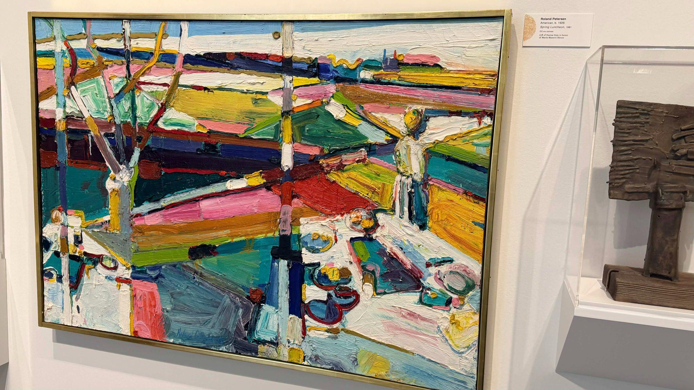

# The Texture of a Season: Abstraction and Emotion in Roland Petersen’s Spring Luncheon

**By:** Stephen Ta  
**Class:** ENL 003A  
**Instructor:** Dr. Iris Jamahl Dunkle  
**Date:** April 13, 2026

---

When I first saw Roland Petersen’s *Spring Luncheon*, I was struck by a sensation that is both striking and puzzling: it is abstract, yet still distinguishable. This tension between abstraction and legibility is at the heart of what makes the painting so compelling—a tension that Petersen crafted with deliberate precision. Through formal choices in color, contrast, and the selective omission of detail, Petersen does not simply depict a scene; he captures a visceral feeling.

Perhaps the most remarkable aspect of *Spring Luncheon* lies in its color palette. The chosen colors are the epitome of spring: soft pinks, warm yellows, fresh greens, and open sky blues sweep across the canvas in bold strokes. However, what elevates this palette beyond a simple, pleasant representation is the integration of darker hues. Thick slashes of deep indigo, dark teal, and heavy crimson cut across the center of the canvas, carving a stark boundary between the picnic and the horizon. 

Rather than disrupting the sunlit mood, these dark, weighty tones provide structural contrast and shape. They ground the composition and give the lighter yellow and soft pink strokes a vivid backdrop against which to truly breathe and expand. This combination of light and dark is far from accidental; Petersen demonstrates an unmatched sense of color value. By understanding how colors relate to one another in terms of lightness and darkness, he uses those relationships to create depth, movement, and emotional resonance. The result is a canvas that feels actively alive.

Looking beyond the color, the composition reveals another layer of meaning. Heavy vertical bands representing "trees" slice straight down the left side of the canvas, while thick, rectangular "sheets" of vibrant color stretch horizontally across the middle ground. These stark geometric planes frame the composition, drawing the eye down to the cluster of round "plates of food" gathered on the bright white tablecloth in the lower-right foreground. 

None of these objects is painted with precision or photographic accuracy. Instead, Petersen uses a heavy *impasto* technique, layering the oil paint so thickly that the physical texture of the canvas mirrors the raw energy of the season. Because of this dense, layered brushwork, the objects do not require clean outlines. Instead, they emerge from the ridges of the paint itself, existing as tactile suggestions and impressions. 

This "lack" of detail is not a flaw, but rather one of the painting’s most successful decisions. By stripping away the specificity that would attach the scene to a particular time, place, or person, Petersen gives the painting a universal quality. The picnic in *Spring Luncheon* does not belong to any single family or afternoon; it belongs to anyone who has ever felt the warmth of a spring day.

This universality is the painting’s greatest achievement, making the viewer's emotional response genuine. *Spring Luncheon* is not a depiction of a specific spring; it is spring as an ambient feeling. Standing before it, one is filled with warmth, almost feeling the sun shining down. The painting does not ask the viewer to remember a particular memory or recognize a specific place; it asks only that they open themselves to a season, and to the easy joy and unhurried light that the word "spring" evokes in the mind. Petersen achieves this not through detail but through its absence, relying on color and form working together in perfect harmony.

Another compelling aspect of *Spring Luncheon* is how it rewards continued attention. It is one of those paintings where the longer one gazes at it, the more resonant it becomes. With each return of the eye, new relationships between colors become visible, new shapes emerge from the layered brushwork, and a deeper feeling of warmth and light makes itself known. Petersen’s painting does not reveal itself all at once. It unfolds gradually, like the season it portrays. In this way, the viewer does not merely observe the scene; they actively participate in it. *Spring Luncheon* is not simply a painting about spring—it is, in its very structure and experience, an act of spring.

---

### Work Cited

Petersen, Roland. *Spring Luncheon*. 1961, Jan Shrem and Maria Manetti Shrem Museum of Art, Davis.
